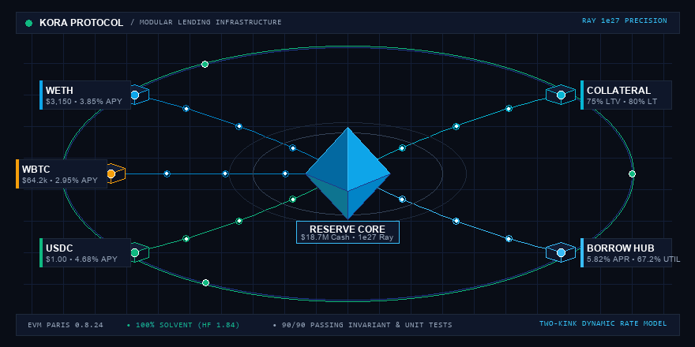
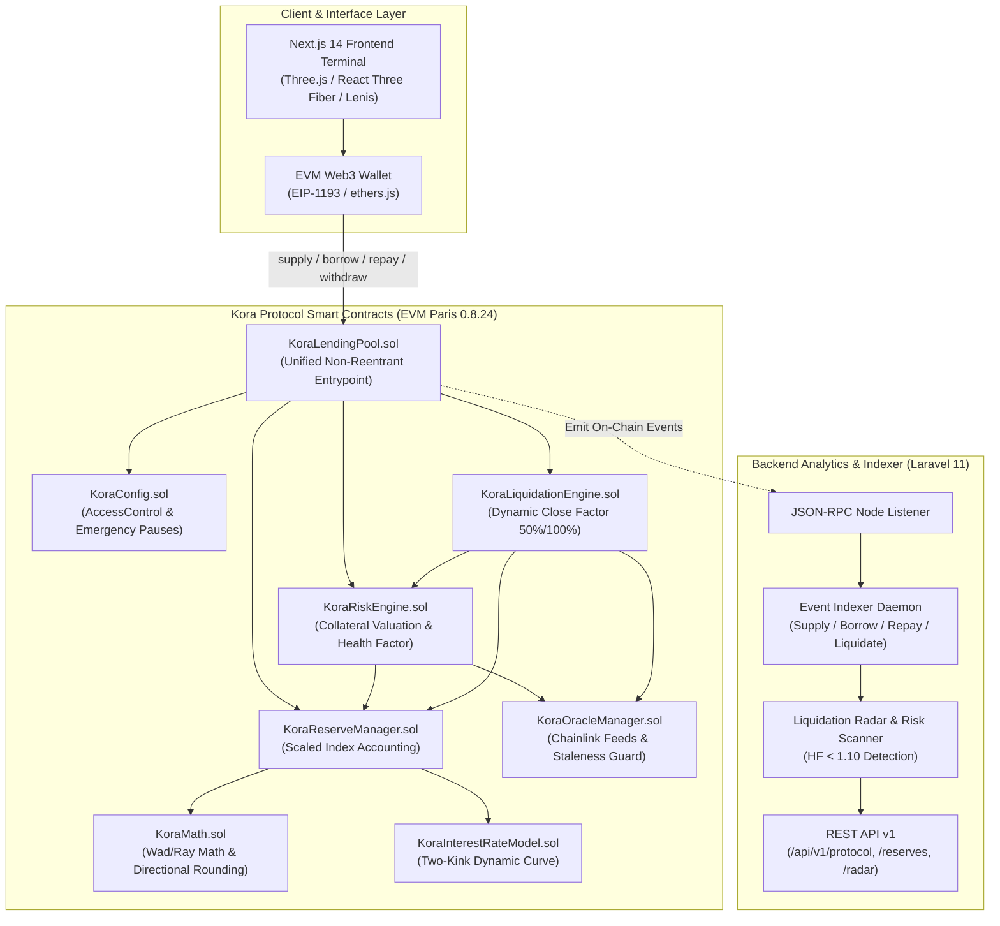

<div align="center">

# Kora Protocol

### *Modular, risk-aware decentralized lending infrastructure.*

<p align="center">
  <a href="#core-architecture"><b>Architecture</b></a> •
  <a href="#how-kora-works"><b>How It Works</b></a> •
  <a href="#smart-contracts"><b>Smart Contracts</b></a> •
  <a href="#testing--verification"><b>Testing (90/90 Passing)</b></a> •
  <a href="#quick-start"><b>Quick Start</b></a>
</p>

<!-- Badges -->
<p align="center">
  
  
  
  
  
  
  
  
  
</p>

---

<!-- Animated 3D Landing Hero Visual -->
<p align="center">
  <picture>
    <source srcset="docs/assets/kora-readme-hero.svg" type="image/svg+xml">
    <source srcset="docs/assets/kora-readme-hero.webp" type="image/webp">
    
  </picture>
</p>

</div>

---

## 1. Project Overview

**Kora** is an institutional-grade, modular DeFi lending and borrowing infrastructure built on Ethereum. 

Unlike yield aggregators or staking platforms, Kora implements a **pure decentralized money market** with constant-time $O(1)$ scaled-balance index accounting, continuous linear interest compounding, multi-tier Chainlink oracle price normalization, dynamic two-kink utilization rate models, and automated liquidations with dynamic close factors.

### Core Value Propositions
- **Deterministic Scaled Accounting**: All user deposits and debts compound in constant time using Wad ($10^{18}$) and Ray ($10^{27}$) arithmetic.
- **Strict Directional Rounding**: Zero inflation attack vectors. Deposit shares and health factors round down; debt shares and debt burns round in protocol favor.
- **Dynamic Two-Kink Rate Curve**: Adapts borrow rates smoothly below an optimal utilization kink ($80\%$) and spikes steeply above it to protect reserve liquidity.
- **Multi-Tier Oracle Safety Guardrails**: Price feeds are normalized to an 18-decimal USD base unit ($10^{18}$) with staleness, heartbeat, and round-id validation.
- **Dynamic Close Factor Liquidations**: Tiered close factors ($50\%$ standard, expanding to $100\%$ below $0.95\text{ HF}$) mitigate bad debt cascades during severe market crashes.

---

## 2. Animated Protocol Lifecycle

The animated visualization above models the full lifecycle of capital moving through Kora's infrastructure:

```text
Liquidity Inflow (USDC / WETH / WBTC)
        ↓
Reserve Core Cash Balance Increases
        ↓
Collateral Supplied & Enabled (LTV & Liquidation Thresholds Assigned)
        ↓
Borrow Position Created via Two-Kink Rate Model
        ↓
Continuous Debt & Cumulative Borrow Index Accrual (1e27 Ray)
        ↓
Real-Time Health Factor ($HF$) Evaluation by Risk Engine
        ↓
Position Preserves Solvency ($HF \ge 1.0$) OR Liquidated with Dynamic Close Factor
```

---

## 3. Core Architecture



---

## 4. How Kora Works

### 1. Supplying & Scaled Index Accounting
When users deposit underlying assets (e.g. USDC or WETH), the pool updates the cumulative liquidity index and mints scaled shares ($S_{shares}$):
$$S_{shares} = \frac{\text{amount}}{I_{liquidity}(t)} \quad [\text{Round DOWN / Floor}]$$
User underlying balance at any time $t$ is computed deterministically in $O(1)$:
$$\text{CurrentBalance}(t) = S_{shares} \times I_{liquidity}(t) \quad [\text{Round DOWN / Floor}]$$

### 2. Two-Kink Dynamic Rate Model
Borrow rates adapt continuously based on reserve pool utilization ($U = \frac{\text{TotalDebt}}{\text{TotalCash} + \text{TotalDebt}}$):
$$R_{borrow}(U) = \begin{cases} 
R_0 + \frac{U}{U_{optimal}} \times Slope_1 & \text{if } U \le U_{optimal} \\
R_0 + Slope_1 + \frac{U - U_{optimal}}{1 - U_{optimal}} \times Slope_2 & \text{if } U > U_{optimal}
\end{cases}$$
- **Base Rate ($R_0$)**: $2.0\%$ APR
- **Optimal Utilization ($U_{optimal}$)**: $80.0\%$
- **Slope 1**: $4.0\%$ APR
- **Slope 2 (Jump)**: $75.0\%$ APR

### 3. Collateral & Health Factor Calculation
The Risk Engine evaluates account solvency in real-time across all enabled collateral:
$$\text{Health Factor } (HF) = \frac{\sum (\text{Collateral}_i \times P_i \times LT_i)}{\sum (\text{Debt}_j \times P_j)} \quad [\text{Round DOWN}]$$
- $HF \ge 1.5$: **Healthy / Safe**
- $1.0 \le HF < 1.5$: **Moderate Risk**
- $HF < 1.0$: **Liquidatable**

### 4. Dynamic Close Factor Liquidation
$$\text{Close Factor} = \begin{cases} 50\% & \text{if } 0.95 \le HF < 1.00 \quad (\text{Standard Liquidation}) \\ 100\% & \text{if } HF < 0.95 \quad (\text{Severe Bad Debt Mitigation}) \end{cases}$$
Liquidators repay the borrower's debt and seize collateral at a $+5\%$ liquidation bonus:
$$\text{CollateralSeized} = \frac{\text{DebtRepaid} \times P_{debt} \times (1 + \text{Bonus})}{P_{collateral}} \quad [\text{Round DOWN}]$$

---

## 5. Reserve Markets

| Asset | Decimals | Price Feed | Max LTV | Liquidation Threshold | Liquidation Bonus | Supply APY | Borrow APR |
| :--- | :---: | :---: | :---: | :---: | :---: | :---: | :---: |
| **USDC** | 6 | `$1.00` | 80.0% | 85.0% | 5.0% | **4.68%** | **5.82%** |
| **WETH** | 18 | `$3,150.00` | 75.0% | 80.0% | 5.0% | **3.85%** | **5.10%** |
| **WBTC** | 8 | `$64,200.00` | 70.0% | 75.0% | 5.0% | **2.95%** | **4.40%** |
| **DAI** | 18 | `$1.00` | 75.0% | 80.0% | 5.0% | **5.12%** | **6.25%** |

---

## 6. Smart Contracts Registry

Local Hardhat & Testnet contract deployments (Chain ID `31337` / Sepolia):

| Contract | Description | Deployed Address |
| :--- | :--- | :--- |
| `KoraConfig` | Protocol configuration, roles & emergency pause | `0x5FbDB2315678afecb367f032d93F642f64180aa3` |
| `KoraReserveManager` | Scaled index progression & user reserve state | `0xe7f1725E7734CE288F8367e1Bb143E90bb3F0512` |
| `KoraOracleManager` | Multi-tier Chainlink feed normalizer & staleness checker | `0x9fE46736679d2D9a65F0992F2272dE9f3c7fa6e0` |
| `KoraRiskEngine` | Collateral valuation & Health Factor calculation | `0xCf7Ed3AccA5a467e9e704C703E8D87F634fB0Fc9` |
| `KoraLiquidationEngine` | Dynamic close factor & bonus seizure execution | `0xDc64a140Aa3E981100a9becA4E685f962f0cF6C9` |
| `KoraLendingPool` | User entrypoint for Supply, Borrow, Repay, Withdraw | `0x5FC8d32690cc91D4c39d9d3abcBD16989F875707` |
| `KoraInterestRateModel` | Two-kink utilization-based rate curve | `0x610178dA211FEF7D417bC0e6FeD39F05609AD788` |
| `MockUSDC` | Testnet 6-decimal USD Coin token | `0xB7f8BC63BbcaD18155201308C8f3540b07f84F5e` |
| `MockWETH` | Testnet 18-decimal Wrapped Ether token | `0xA51c1fc2f0D1a1b8494Ed1FE312d7C3a78Ed91C0` |

---

## 7. Technology Stack

```text
Blockchain / Smart Contracts
├── Solidity 0.8.24 (EVM Paris Target, viaIR enabled)
├── Hardhat v2.22.2 & Hardhat Toolbox
└── OpenZeppelin Contracts v5.0 (AccessControl, ReentrancyGuard, SafeERC20)

Frontend Terminal (Next.js)
├── Next.js 14.1.3 & React 18
├── TypeScript 5.3 & Tailwind CSS 3.4
├── Three.js 0.162 & React Three Fiber (R3F) 8.16
├── @react-three/drei & @react-three/postprocessing
├── Lenis v1.0 (Single global smooth scroll instance)
└── Framer Motion 11.0

Backend Analytics & Indexer (Laravel)
├── Laravel 11.0 (PHP 8.2+)
├── Guzzle JSON-RPC Blockchain Node Client
└── Modular Services (Blockchain, Lending, Risk, Liquidation, Analytics)
```

---

## 8. Testing & Verification

Kora includes **90 automated tests** with 100% pass rate covering mathematical unit behavior, integration lifecycles, and formal accounting invariants:

```bash
$ npx hardhat test

  90 passing (5s)

  ✔ KoraMath (Unit Tests) — Wad (10^18) & Ray (10^27) arithmetic with directional rounding
  ✔ KoraConfig (Unit Tests) — Granular roles, emergency pauses, dynamic parameter bounds
  ✔ KoraInterestRateModel (Unit Tests) — Dynamic two-kink curve & utilization APY/APR
  ✔ KoraLendingPool — Supply & Withdraw (Unit Tests) — Scaled shares, caps, balance checks
  ✔ KoraLendingPool — Borrow & Repay (Unit Tests) — Debt shares, liquidity verification
  ✔ KoraOracleManager (Unit Tests) — Normalization to 1e18 USD, heartbeat & staleness checks
  ✔ KoraRiskEngine (Unit Tests) — Collateral valuation, borrowing capacity, Health Factor
  ✔ KoraLiquidationEngine (Unit Tests) — Dynamic close factor (50%/100%), seizure bonus
  ✔ Supply & Withdraw Full Lifecycle (Integration) — Multi-user index accrual & exact payouts
  ✔ Borrowing & Interest Accrual Lifecycle (Integration) — 1-year linear compounding & repayment
  ✔ Multi-Asset Collateral & Borrowing Lifecycle (Integration) — Safe partial withdrawals
  ✔ End-to-End Liquidation Lifecycle (Integration) — Market drop & solvency restoration
  ✔ Supply & Withdraw Accounting Invariants — Sum of shares == total supply, monotonicity
  ✔ Borrowing & Debt Accounting Invariants — Conservation of liquidity, monotonic borrow index
  ✔ Liquidation Solvency & Health Invariants — HF >= 1.0 unliquidatable, debt/HF improvement
```

---

## 9. Performance & Accessibility

- **Capped DPR**: 3D canvas is capped at `dpr={[1, 2]}` to prevent GPU fill-rate throttling on $3\times$ Retina screens.
- **Instanced Geometry**: Flow particles are rendered in a single `InstancedMesh`, keeping scene draw calls $< 15$.
- **`prefers-reduced-motion` Support**: Dynamically detects OS motion preferences to freeze pointer parallax and looping pulse animations.
- **Graceful WebGL Fallback**: Automatically renders a high-contrast 2D/SVG technical blueprint when WebGL is unsupported or disabled.
- **Single Global Lenis Instance**: Smooth scrolling is managed strictly at the application root, avoiding duplicate RAF loops.

---

## 10. Quick Start

### 1. Smart Contracts
```bash
# Clone the repository
git clone https://github.com/nalatif7114/Kora-Protocol.git
cd Kora-Protocol

# Install dependencies
npm install

# Compile contracts
npx hardhat compile

# Run all 90 unit, integration, and invariant tests
npx hardhat test

# Deploy core protocol contracts locally
npx hardhat run scripts/deploy-core.js
```

### 2. Frontend Institutional Terminal
```bash
cd frontend

# Install frontend dependencies
npm install --legacy-peer-deps

# Run development server
npm run dev

# Build production bundle
npm run build
```


## 12. License

This project is licensed under the **MIT License**. See [`LICENSE`](LICENSE) for details.
